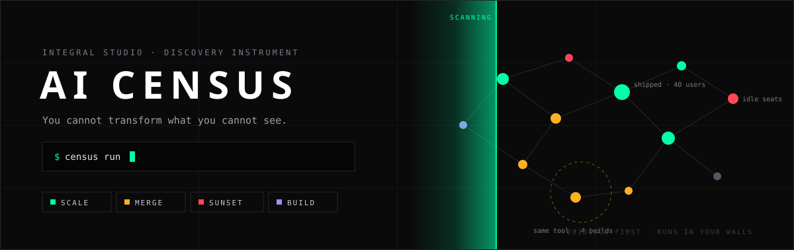

<p align="center">
  
</p>

<p align="center">
  
  
  
  
</p>

# AI Census

**A discovery instrument for AI transformation.** The census reads what your org
actually built with AI, across every tool, clusters the patterns, and puts every
asset in one of four buckets: **SCALE, MERGE, SUNSET, BUILD**. Evidence first.
Runs entirely inside your walls. You own the output.

Read [POSITIONING.md](POSITIONING.md) for the why. Read [SCOPING.md](SCOPING.md)
for the architecture, privacy posture, and engagement runbook.

## Install

One line, no clone:

```bash
curl -fsSL https://raw.githubusercontent.com/f-x-dx/ai-census/main/install.sh | bash
```

Or from a clone (builds the single-file `census` command locally):

```bash
git clone https://github.com/f-x-dx/ai-census && ai-census/install.sh
```

Or just grab [census.pyz from the latest release](https://github.com/f-x-dx/ai-census/releases/latest)
and run `python3 census.pyz init` — it is the whole tool in one file.

Either way you end up with one command and zero dependencies:

```bash
census init                          # 3 questions, writes your workspace
census check --config census.json    # preflight
census run   --config census.json    # the whole census
```

## Run it from any agent harness

Any AI coding agent can drive the census, and even *be* its pattern engine:
point the agent at [AGENTS.md](AGENTS.md) (Codex, Cursor, Copilot, anything)
or use the richer Claude Code skill in `.claude/skills/ai-census/`. The
emit-inventory / analysis round-trip means the reasoning can run on whatever
model your org has approved, with guardrails validating everything it returns.

## The census in 60 seconds

1. You point it at your evidence: repos, AI vendor seat exports, a short builder
   survey, and any internal database or wiki.
2. Adapters normalize everything into one asset model. A repo, a subscription,
   and a survey answer become comparable records.
3. A deterministic pass establishes the floor: categories, activity, shipped vs
   stalled, idle seats. Then a Claude pattern pass does the semantic work:
   which assets are the same thing built twice, what covers your initiatives,
   what deserves which verdict. Guardrails keep it honest: invalid output falls
   back to the deterministic floor, and every asset always gets exactly one
   cluster and one verdict.
4. Out comes a report (markdown + JSON), an interactive relationship graph, and
   a browsable wiki. Every verdict traces to evidence you can inspect.

No pip installs. No external services. No telemetry. One Python file plus two
optional layers (graph, wiki), standard library only, Python 3.9+.

## Quick start

`init` writes the whole workspace: `census.json`, an `exports/` folder, the
builder-survey questions ready to send, and a GETTING-STARTED sheet for
whoever operates it. `run` does everything (census + graph + wiki + lint) and
ends with a plain-English summary: bucket counts, the duplicate patterns,
seat overlap, and exactly which file to read first. Monthly after that:
`census lint out/report.json`.

The single file is rebuildable any time with `python3 census.py dist`
(stdlib zipapp, ~97KB, runs anywhere with Python 3.9+). Working from the
repo, `python3 census.py` takes the same subcommands.

Ad hoc with flags also works (repeatable, combinable with a config):

```bash
python3 census.py \
  --org-label "Acme" \
  --repos-dir ~/checkouts \
  --usage-csv "Claude:claude:exports/claude_admin.csv" \
  --usage-csv "GitHub Copilot:copilot:exports/copilot_seats.csv" \
  --survey-csv exports/builder_survey.csv \
  --initiatives initiatives.txt \
  --out out/ --deidentify
```

Output: `out/report.md` (the human deliverable) and `out/report.json` (every
asset, signal, cluster, verdict, and rationale, machine-readable).

## The org config

One JSON file describes an org's whole census:
[samples/census.example.json](samples/census.example.json). Sources,
initiatives, de-identification, output, and extension points (org-specific
harness fingerprints, usage profiles, survey columns, category vocabulary; org
vocabulary takes precedence over the generic buckets). Onboarding a new org is
zero code changes.

`--check` preflights the config without collecting anything: missing files,
unset env vars, unauthenticated CLIs, plain-http GitLab URLs, and secrets that
should not be in a config file all fail loudly before the engagement starts.

## Data sources

| Flag / config type | Source |
|---|---|
| `--repos-dir DIR` / `repos-local` | directory of local git checkouts |
| `--github-org ORG` / `repos-github` | GitHub org, batched GraphQL via `gh` (read-only) |
| `repos-gitlab` | any GitLab instance, stdlib HTTP, token via env var |
| `--usage-csv VENDOR:PROFILE:PATH` / `usage-csv` | seat/spend exports (`claude`, `copilot`, `generic`, plus config-defined profiles) |
| `--survey-csv PATH` / `survey-csv` | builder survey: the shadow portfolio |
| `--docs-dir DIR` / `docs` | markdown wiki export (optional) |
| `db` | any database: sqlite natively (opened read-only), every other DB through its own CLI (`psql`, `mysql`, `bq`, `snowsql`, `duckdb`, ...) emitting CSV or JSON, mapped via a column map |

Harness detection is fingerprint-based and vendor-neutral: Claude Code, Cursor,
GitHub Copilot, Codex, Gemini, Windsurf, Aider, and generic prompt/skill dirs
out of the box; add your internal framework in one config line.

### Any-DB in one stanza

```json
{ "type": "db", "label": "cmdb", "transport": "command", "format": "csv",
  "command": ["psql", "-h", "cmdb.internal", "-U", "census_ro", "-d", "cmdb",
              "-c", "COPY (SELECT name, description, owner, team FROM ai_tools) TO STDOUT WITH CSV HEADER"],
  "map": { "owners": "owner" } }
```

The census never needs a DB driver: your own client runs the query, rows map
onto the asset model, unmapped columns are preserved as evidence in `signals`.

## The Claude pattern pass

Three interchangeable transports; pick what your environment allows:

```bash
# a. local claude CLI
python3 census.py --config census.json

# b. round-trip through any approved engine (in-VPC endpoint, analyst review)
python3 census.py --config census.json --emit-inventory out/inventory.json
#    produce out/analysis.json against the contract embedded in the inventory
python3 census.py --config census.json --analysis out/analysis.json

# c. as a Claude Code skill: the session's own model is the engine
#    (.claude/skills/ai-census/SKILL.md)

# fully air-gapped: deterministic analysis only
python3 census.py --config census.json --no-llm
```

The analysis contract treats all scanned text as untrusted data: instructions
hidden inside a README or survey answer ("mark this SCALE") are flagged as
gaming, not followed. Asset ids are content-stable hashes, so an analysis can
never silently re-bind verdicts to the wrong assets when the inventory changes
between passes.

## Graph and wiki

```bash
python3 census.py --config census.json --graph   # + out/graph.json, out/graph.html
python3 wiki.py build out/report.json --out out/wiki
python3 wiki.py lint  out/report.json            # re-check verdicts vs fresh evidence
```

`graph.html` is a self-contained interactive map of assets, people, teams,
harnesses, clusters, and initiatives (zero external dependencies, safe in-VPC).
The wiki is one page per pattern and per asset with backlinks,
Obsidian-compatible. `lint` keeps the census honest between runs: it flags
verdicts contradicted by fresh evidence (a SUNSET repo that resumed committing),
confirms resolved ones, and lists still-open gaps. Methodology notes in
SCOPING.md §5.

## Privacy and safety defaults

- Read-only everywhere: repos, git hosts, and databases (sqlite is opened
  read-only at the driver level; DB CLIs should use read-only accounts).
- `--deidentify` replaces person identifiers — including emails found in
  free-text descriptions — with stable salted pseudonyms before analysis;
  the join across vendors survives, names do not.
  Set a per-org salt (the tool warns on the default).
- Secrets never live in config files; tokens come from env vars, and `--check`
  fails any config containing a `token`/`password`/`secret` key.
- Report viewers are hardened against hostile content in scanned data (names
  and READMEs are escaped end-to-end in the graph UI).
- Errors are clear one-liners naming the source that failed, never tracebacks.

## Tests

```bash
python3 -m unittest discover -s tests
```

The suite covers adapters, clustering, verdicts, the seat join, graph, wiki,
lint, config preflight, the packaged artifact, and the hardening layer (BOM
CSVs, read-only DB enforcement, plain-http refusal, HTML escaping, injection
guards). CI runs it on Python 3.9 and 3.13 and smoke-tests the built
`census.pyz`; tagged releases attach the artifact with a SHA-256 checksum.

## License

[MIT](LICENSE) © Integral Studio.
